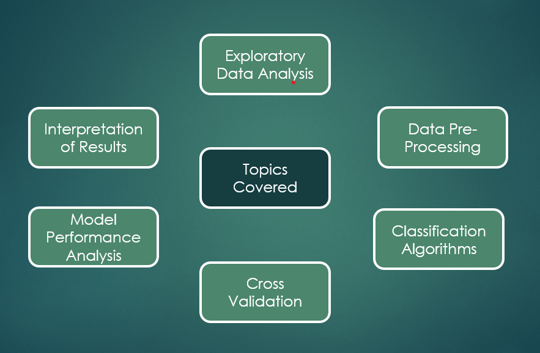

# Detecting and Classifying Electrical Faults

The transmission of electrical power is an area that the majority of us take for granted, however due to the highly complex nature of power systems, electrical faults are always a looming threat. Particularly in countries such as Ireland and the UK, which are rapidly incorporating an increasing amount of non-synchronous wind power onto their grids. To avoid serious consequences from system imbalances or failures, such as the dreaded “blackout”, competent fault detection systems are essential. These would ideally detect and correctly classify any faults that arise rapidly. As such, accuracy and model efficiency should be a primary focus. Machine Learning could serve as a tool to achieve greater understanding of a power system and classify faults. The dataset being used contains information on currents and voltages in three phases, for different fault conditions. This data was generated through simulation.

